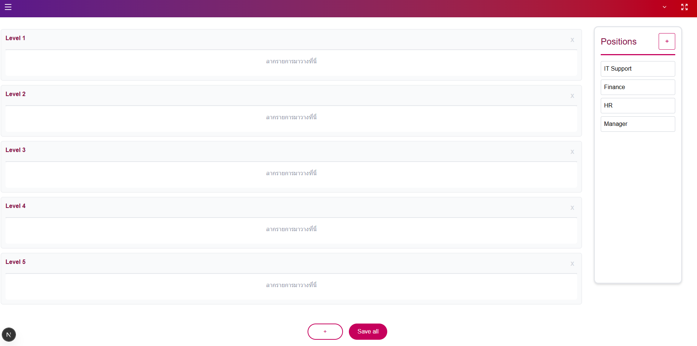

# Drag & Drop Organization Chart

This repository contains a drag-and-drop organization chart application built with Next.js, React, TypeScript, and Tailwind CSS.
The project focuses on visualizing hierarchical positions (levels, parents, children) with interactive drag & drop, hover states, and state management via React Context.

Quick summary

Frontend: Next.js (App Router) + React, TypeScript

Styling: Tailwind CSS

State Management: React Context

Features: Drag & Drop positions, dynamic levels, hover actions, save state

Backend: ❌ (Frontend-only, data handled in-memory / local logic)

## Demo

# Features

📦 Dynamic Levels – Add or remove organization levels

🧩 Drag & Drop Positions – Move positions across levels

🌳 Parent–Child Relationship – Automatically track hierarchy

🖱️ Hover Interaction – Show actions and connection highlights

💾 Save All – Persist current structure (logic-ready for API)

🎨 Responsive UI – Built with Tailwind CSS

# Prerequisites

Node.js >= 18

npm / pnpm / yarn

Local setup (Windows PowerShell)

Clone repository

git clone https://github.com/Chayanon-Pond/Drag-Drop.git
cd Drag-Drop

npm install

npm run dev

Open in browser:

http://localhost:3000
